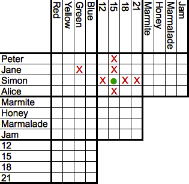

# A first look at data
## Lecture
- https://www.youtube.com/watch?v=sPeUnUICTWs&feature=youtu.be

## Pre-class videos
- https://www.youtube.com/watch?v=yZihmKNXkkE
- https://www.youtube.com/watch?v=7unI6oGI6_Q

## Readings
### Learn to explain what quantifiable data is (and isn't)

Modern computers are capable of processing remarkably complicated input - natural language, pictures, audio, and more. But while this has lead many to believe that computers are “intelligent”, as data scientists we must understand that at its base quantifiable data is simple and structured, and is the building block that any of these applications starts from.

#### Overview
It is widely known that computers are binary - at their base, everything is a number, and specifically a sequence of 0s and 1s. While this is a simplification, it is a useful one for making the critical point that, to a computer, data must be numeric and consistent.

Numeric means “made of numbers”, and we are certainly allowed to go beyond 0 and 1 (the underlying architecture translates the representation for us). So 2, -0.5, and 3.14 are all fair game - and in most stituations, scientific notation like 7e0 (equivalent to 7 * 10^9) is also allowed. Note that these are all `finite - some languages can represent infinity (`from math import inf` in Python >3.5). Also in Python, for floating point values (numbers with decimal points) the precision (how many digits they have) is a function of your available memory - so it can be fairly long, but sitll finite (no representing all of pi).

Consistent means that, for any given “thing” (aspect of your data usually called features) you’re representing, you do it the same way each time. If sometimes you write a number with numerals (3) and other times you spell out the word (“three”), the computer does not know what you mean even though a human would be fine with it. This is a particularly common problem for manually created spreadsheets from laypeople - there is an expectation that computers are “smart” these days, but in this situation the only “intelligence” is cleaning the data ahead of time with whatever logic to correct inconsistencies.

It’s our job to _make_ the computer smart - this means feeding it information it can learn from. And doing this well means appreciating that, while computers are much faster than humans, they are not naturally adaptive as we are. As you go deeper in this topic you’ll learn about techinques to derive insight from unstructured data, but even then consistency matters and a numeric representation is the usual goal.

#### Follow Along
In order to start thinking about quantifiable data, it’s good to translate “real-world” scenarios into data that could potentially be computed with. Consider the following example:

_Joe, Alice, and Sarah are students. Joe is male and 19 years old, Alice and Sarah are female and both 20 years old._

Suppose we wanted to represent this with Python code. First we should think what the unit of observation is - this is the entity that is describing, the rows of a spreadsheet if we want to visualize it. The sentences are describing three people, but more specifically students.

Next, we need to determine the features - the columns of a spreadsheet, and what we “know” about the entities. The text describes their names, gender, and age.

As a basic representation, let’s have each student be a dict containing their features, and put all students together in a list. The last step is to figure out how we’re representing the features - we want them to be as numeric as possible. Names are difficult to quantify so for now we’ll keep those as strings. Age is naturally a number. Gender can be treated (for the purposes of this example) as binary, so let’s encode it as `is_female`.

```python
joe = { 'name': 'Joe', 'is_female': False, 'age': 19 }
alice = { 'name': 'Alice', 'is_female': True, 'age': 20 }
sarah = { 'name': 'Sarah', 'is_female': True, 'age': 20 }
students = [joe, alice, sarah]
```
Reproduce this code, and investigate and interact with the `students` object - you’ll see it has all the data described in the text, and is in some ways similar (though much less featured) than the dataframes we’ll be typically interacting with.

#### Challenge
Using Python, write code that quantifies the following data:

Grow Mart, Plant Depot, and Trees’R’Us are gardening stores in a city. Grow Mart and Plant Depot were both founded in 1973, and Trees’R’Us was founded in 1985. Grow Mart has annual revenue of $265k and expenses of $183k, Plant Depot has $302k revenue and $240k expenses, and Trees’R’Us has $123k revenue and $130k expenses.

In addition to describing the above, add a feature `is_profitable`. What sort of feature should this be, and how should it be determined? Optional stretch goal - you may be familiar with logic puzzles such as these:



Play a [random logic puzle](https://www.logic-puzzles.org/init.php), and use Python to encode and track the entities as you solve it.

### Learn to distinguish between common variable types (continuous/discrete, ordinal/categorical)

In order to represent data appropriate, or fit the right sort of model, one must first know what flavor of data they have. Is it “soupy”, continuous real values that can essentially be any number? Is it discrete, a specific enumerated set? And if it is discrete, does order matter, or is it purely categorical?

These questions have some different nuances and rules of thumb in data science than they do in pure math, so while it’s great to bring any prior understanding you have, keep an eye out for potential differences as well.

#### Overview
Not all numbers are created equal - and indeed, not all quantifiable things are numbers in the sense a mathematician would define it (though they’ll still be represented as numbers internally on the computer).

- Continuous numbers: these are also called “real” by mathematicians (we’re generally not concerned with [imaginary numbers](https://en.wikipedia.org/wiki/Imaginary_number) in Data Science). Anything that is floating point (e.g. 3.14) is continuous, but for many statistical approaches it can make sense to start considering something continuous as soon as it has ~30 or more ordered equally spaced values. For example, human age is often treated as continuous, even though it is usually encoded in years and so there’s only ~120 unique ordered values (ages from 1-120 years old).

- Discrete ordered numbers: the age example as defined is actually discrete, mathematically. Practically for Data Science we’re more likely to treat e.g. grade in school (from 1-12) as discrete ordered numbers. Depending on context and the underlying data, these may also be called ranks, scores, or other terms.

- Discrete unordered categories: many things in life can be separated into buckets, but not with a clear universal ordering of the buckets. For example, species - cat, dog, or human. This data could be represented with numbers (e.g. 1, 2, 3) and a codebook (or Python dictionary) that translates to the true value. But more commonly, one-hot encoding is used - for that, see binary variables.
- Binary variables: a special case of discrete categories, where there’s only two options. These are then encoded 0/1 (or False/True), and many statistical approaches can be applied to them. In practice, variables with more then two categories are often translated into a collection of binary variables - one for each possible category. For example, a species variable of cat, dog, human may become three binary variables - is_cat, is_dog, and is_human. This is called one-hot encoding, and [sklearn in Python has functionality to facilitate this](https://scikit-learn.org/stable/modules/generated/sklearn.preprocessing.OneHotEncoder.html).

You may be wondering - what about strings? Strings are hard - a computer represents the actual object as a sequence of numbers (bytes corresponding to characters), but the semantic meaning (how we interpret it) is another matter. Later in the course we’ll get to techniques to tackle this (natural language processing, vectorization), but for now strings should just be treated as labels. If each observation tends to have a unique entry for a string then it’s a label of that entity (e.g. name) - if there are a few recurring strings (e.g. “male”, “female”) then it may actually be a categorical variable that you will want to transform or otherwise ensure is treated numerically by the algorithm you feed it to.

#### Follow Along
Revisit both the lecture notebook and the first notebook from the intro course. We’ll be using that notebook to work through the material above and understand how to distinguish between variable types.

#### Challenge
Pick at least one Python DS library, and using documentation/examples reproduce in the lecture notebook something cool. It’s OK if you don’t fully understand it or get it 100% working, but do put in effort and look things up.